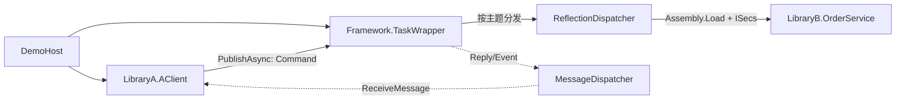

# 当前项目设计模式分析

## 1. 文档范围

本文依据当前源码分析以下四个项目：

- `DemoHost`：进程入口和对象装配。
- `LibraryA`：消息发起方，当前实现为 `AClient`。
- `LibraryB`：业务执行方，当前实现为 `OrderService`。
- `Framework`：消息、订阅、分发、反射加载和公共接口。

分析重点是当前代码实际形成的协作关系。仅存在设计意图、但尚未形成完整执行链的模式会单独说明。

## 2. 总体结论

当前项目的核心是一个**进程内事件聚合器/消息总线**。`TaskWrapper` 同时承担中介者和消息路由器的职责；`MateoMsg`/`CommandMsg` 表达命令消息；不同的 `IDispatcher` 根据主题处理消息；`ReflectionDispatcher` 再通过反射加载实现 `ISecs` 的 B 类库类型。

可以概括为：

> 事件聚合器（发布—订阅） + 中介者 + 命令消息 + 消息分发器 + 反射式插件加载。

请求—响应模式已经出现了 `Reply`、`Event`、`MessageDispatcher` 和 `ReceiveMessage` 等结构，但当前执行链尚未把 B 的结果发布回 A，因此它目前属于设计意图，而不是已经完成的模式闭环。

## 3. 当前结构



实线表示当前可以执行的调用链；虚线表示已经搭建结构、但当前没有结果发布者触发的返回链。

## 4. 已实际使用的模式

### 4.1 事件聚合器 / 发布—订阅模式

这是当前项目最主要的模式。

主要参与者：

- 发布者：`LibraryA.AClient`。
- 事件聚合器：`Framework.TaskWrapper`。
- 主题：`Msg.Command`、`Msg.Reply`、`Msg.Event`。
- 订阅者：`ITask` 或 `IDispatcher` 实例。
- 消息：`MateoMsg`。

实现证据：

- `TaskWrapper.Subscribe` 将 `ITask` 添加到指定主题。
- `TaskWrapper.InternalSubscribe` 注册 Framework 内部的 `IDispatcher`。
- `TaskWrapper.PublishAsync` 向外部任务和内部 Dispatcher 分发消息。
- `TaskWrapper.Unsubscribe` 删除外部订阅。

它和经典观察者模式很接近，但更准确的名称是“事件聚合器”或“发布—订阅”：发布者不直接保存观察者，而是通过一个按主题路由的中心对象完成通信。

### 4.2 中介者模式

`TaskWrapper` 同时扮演中介者：A 不直接创建或调用 B，而是把消息交给 `TaskWrapper`；B 的加载和调用由 Framework 内部完成。

依赖关系为：

```text
LibraryA  ──> Framework <── LibraryB
```

这种结构减少了 A 与 B 的直接耦合。A 当前只需要知道主题和消息格式，不需要在项目引用中依赖 B。

需要注意：`DemoHost` 仍然引用 LibraryB，目的是让 B 的程序集进入应用依赖和输出目录，供运行时反射加载。

### 4.3 命令模式（简化形式）

`CommandMsg` 将“需要执行一次业务动作”的信息封装为消息：

- `MsgType = "C"` 表示命令消息。
- `AssemblyName` 描述目标程序集。
- `TypeName` 描述目标类型。
- `MethodName` 描述目标方法。
- `Command` 描述业务命令，例如 `Command.Order`。

`AClient` 创建命令对象后只负责发布，不直接执行 B 的业务代码。这符合命令模式中“请求发送者与请求执行者分离”的思想。

### 4.4 消息分发器模式

`IDispatcher` 定义统一的异步消息处理入口：

```csharp
Task HandleAsync(MateoMsg msg);
```

当前有两个实现：

- `ReflectionDispatcher`：订阅 `Command`，负责加载 B 并调用 `ISecs.RunAsync`。
- `MessageDispatcher`：订阅 `Reply` 和 `Event`，负责回调 A 的 `ReceiveMessage`。

`TaskWrapper` 只依赖 `IDispatcher` 接口，按主题调用不同实现。这是明确的多态分发结构。它带有策略模式的特征，但当前更准确的名称是“按主题选择的消息分发器”，因为这里不是由调用方主动替换某个算法策略。

### 4.5 简单工厂

`MateoMsg` 提供以下静态创建方法：

- `CreateMsg()`
- `CreateCommandMsg()`
- `CreateCommandMsg(string command)`

调用方不需要直接了解 `CommandMsg` 的初始化细节，例如默认的消息类型和目标元数据。

这是“简单工厂”写法，不是 GoF 定义中的工厂方法模式：它使用静态方法直接决定并创建具体类型，没有通过可重写的工厂方法让子类决定产品类型。

### 4.6 依赖倒置与插件式加载

这部分首先是架构原则，其次具有插件机制的特征：

- A、B 都依赖 Framework 中的公共接口和消息类型。
- B 的 `OrderService` 实现 `ISecs`。
- `ReflectionDispatcher` 不引用 LibraryB，而是在运行时加载程序集并查找 `ISecs` 实现。

因此 Framework 面向 `ISecs` 抽象工作，具体实现可以放在外部类库中。新增另一个 B 类库时，理论上可以通过实现 `ISecs` 并提供程序集来扩展，而不必让 Framework 在编译期引用它。

当前实现默认选择程序集中的第一个 `ISecs` 类型。如果一个程序集有多个实现，需要增加明确的类型选择规则。

### 4.7 手工依赖注入和回调

项目没有使用依赖注入容器，而是采用手工装配：

- `Program` 创建 `AClient` 和 `TaskWrapper`，再把 wrapper 赋给 A。
- `TaskWrapper` 构造函数创建两个 Dispatcher，并传入 `InternalSubscribe` 委托。
- `MessageDispatcher` 保存 `task.ReceiveMessage` 作为回调委托。
- `ReflectionDispatcher` 通过反射给 B 的 `wrapper` 后备字段赋值。

前三项属于手工依赖注入/委托回调。最后一项也是运行时注入，但它直接依赖编译器生成的私有后备字段名称，比较脆弱；更常见的做法是构造函数注入或公开只用于初始化的属性。

## 5. 尚未闭环的请求—响应模式

项目已经为请求—响应准备了以下角色：

- 请求：`Msg.Command`。
- 响应主题：`Msg.Reply`。
- 事件主题：`Msg.Event`。
- 响应分发器：`MessageDispatcher`。
- A 的接收入口：`ITask.ReceiveMessage`。
- 消息标识：`MateoMsg` 构造时创建的 `Msg.Id`。

但是当前运行路径在 `OrderService.RunAsync` 返回后结束：

- `ReflectionDispatcher` 没有创建 Reply 消息。
- `SecsWrapper.SendMsg` 为空。
- 没有代码调用 `PublishAsync(Msg.Reply, resultMessage)`。
- `MessageDispatcher` 因而不会触发 A 的 `ReceiveMessage`。
- 当前也没有使用 `Msg.Id` 将请求与响应对应起来。

因此当前准确结论是：**存在请求—响应模式的结构和命名，但尚未实现实际响应链路。**

## 6. 当前真实执行流程

1. `DemoHost.Program` 创建 `AClient`。
2. Program 创建 `TaskWrapper(client)` 并赋给 `client.wrapper`。
3. `TaskWrapper` 创建 `ReflectionDispatcher` 和 `MessageDispatcher`。
4. 两个 Dispatcher 分别订阅 `Command`、`Reply` 和 `Event`。
5. Program 通过 `ITask.Run()` 启动 A。
6. A 使用简单工厂创建 `CommandMsg`，并发布到 `Msg.Command`。
7. `TaskWrapper` 将 Command 路由给 `ReflectionDispatcher`。
8. `ReflectionDispatcher` 加载 `LibraryB`，查找第一个实现 `ISecs` 的类型。
9. Framework 创建 `OrderService`，反射写入 `SecsWrapper`，然后调用 `ISecs.RunAsync()`。
10. `RunAsync()` 完成后流程结束，目前没有向 A 返回结果。

特别说明：`OrderService.ProcessAsync(object?[] args)` 当前不会被调用，因为它是私有方法，而且 `ReflectionDispatcher` 没有按消息中的 `MethodName` 查找方法。

## 7. 不应误判为设计模式的内容

### 7.1 反射

`Assembly.Load`、`Activator.CreateInstance`、`GetTypes` 和 `GetField` 是动态加载与调用技术，不是设计模式。它们在本项目中用于实现插件式晚绑定。

### 7.2 async/await

异步任务是并发与异步编程机制，不是设计模式。

### 7.3 名称包含 Wrapper

类名为 `TaskWrapper` 或 `SecsWrapper`，并不自动代表装饰器模式或适配器模式。当前：

- `TaskWrapper` 的主要职责是事件聚合器、中介者和消息路由。
- `SecsWrapper` 目前只有空的 `SendMsg` 方法，尚不足以判定为适配器、代理或装饰器。

### 7.4 责任链模式

同一主题下的 Dispatcher 会被依次全部调用，但处理器没有“是否已处理”结果，也不会决定是否把消息交给下一个节点。因此当前更接近多播发布—订阅，不是典型责任链。

## 8. 模式完整度和风险

### 已形成完整结构

- 事件聚合器/发布—订阅。
- 中介者。
- 消息分发器。
- 简单工厂。
- 基于公共接口的运行时插件加载。

### 部分形成

- 命令模式：消息携带目标信息，但大部分字段尚未用于执行。
- 手工依赖注入：A 使用属性赋值，B 使用私有字段反射注入。
- 门面特征：`TaskWrapper` 对外集中提供发布、订阅和退订，但同时承担较多内部职责。

### 尚未完成

- 请求—响应闭环。
- 使用消息 `Id` 关联请求和响应。
- 调用消息指定的 `TypeName`、`MethodName` 和参数。

### 当前实现风险

- `src/LibraryA/TaskWrapper.cs` 与 `src/Framework/TaskWrapper.cs` 定义了同名、同命名空间的类型，但它们属于不同程序集。LibraryA 会优先使用自己的类型，导致 `AClient.wrapper` 与 `ITask.wrapper` 的类型身份不一致。
- `ConcurrentDictionary` 只能保证字典本身的并发操作安全，字典中保存的 `Queue<T>` 并不是线程安全集合。
- “先检查、再赋值”的订阅逻辑不是原子操作，并发订阅同一主题时可能覆盖队列。
- B 的 wrapper 注入依赖 `<wrapper>k__BackingField` 这一编译器生成名称。
- 当前选择程序集中的第一个 `ISecs` 实现，存在选择不确定性。
- 在第二份 `TaskWrapper` 出现前，解决方案曾构建成功并有 5 个可空引用警告。
- 按当前文件状态重新构建时失败：1 个 `CS0738` 错误和 3 个警告，其中 `CS0436` 明确报告两个 `TaskWrapper` 类型冲突。

## 9. 源码索引

- `src/Framework/TaskWrapper.cs`：事件聚合器、中介者和主题路由。
- `src/LibraryA/TaskWrapper.cs`：当前新增的重复定义；逻辑与 Framework 版本近似，但会造成跨程序集类型冲突，不应视为第二个独立模式角色。
- `src/Framework/IDispatcher.cs`：统一分发接口。
- `src/Framework/ReflectionDispatcher.cs`：Command Dispatcher 和反射式插件加载。
- `src/Framework/MessageDispatcher.cs`：Reply/Event Dispatcher 和回调。
- `src/Framework/MateoMsg.cs`：消息对象、命令消息和简单工厂。
- `src/Framework/Msg.cs`：主题、消息字段和业务命令常量。
- `src/Framework/ITask.cs`：A 类库任务约定。
- `src/Framework/ISecs.cs`：B 类库插件约定。
- `src/LibraryA/AClient.cs`：命令发布者及预留的消息接收者。
- `src/LibraryB/OrderService.cs`：当前 B 端 `ISecs` 实现。
- `src/DemoHost/Program.cs`：组合根和手工依赖装配。

## 10. 最终判断

如果只用一句话描述当前架构：

> 当前项目采用以 `TaskWrapper` 为中心的进程内事件聚合器和中介者架构，通过命令消息与多态 Dispatcher 路由请求，并利用 `ISecs` 接口和反射实现 B 类库的运行时加载；返回消息链已经预留，但尚未完成。
